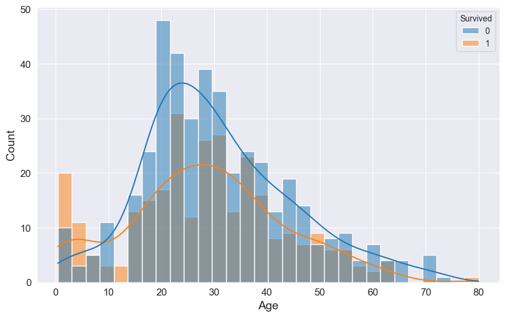

My first project.

https://www.kaggle.com/competitions/titanic

It seems like the 'hello world' in ML.

## Data Processing:

After we get the dataset, we need to process the data first:

``` python
print(train.isnull().sum())
print(test.isnull().sum())
```
This code is used to count the number of missing values, and we will know number of missing values in each feature.

After we know the number of missing values, we can process the data by using these method:

There are 327 missing values in Cabin and we are hard to fill it, so we can just delete this feature.

``` python
train = train.drop('Cabin', axis = 1)
test = test.drop('Cabin', axis = 1)
```

We can use the median to fill in the missing values of age. I believe it is better than the mean because age has a skewed distribution in this dataset.

```python
plt.figure(figsize = (10,6))
sns.histplot(data = train, x = 'Age', hue = 'Survived', kde = True, bins = 30)
plt.show()
```



``` python
age_median = train['Age'].median()
train['Age'] = train['Age'].fillna(age_median)
test['Age'] = test['Age'].fillna(age_median)
```
And there are 2 missing values in Embarked, we can also fill them by the mode.

Next step is modify the categorical variable encoding:

ML model only accept number as their input so we cannot use strings:

1. Sex: male --> 1, female -->0:

```python
train['Sex'] = train['Sex'].map({'male':0, 'female':1})
test['Sex'] = test['Sex'].map({'male':0, 'female':1})
```

2. Embarked: S -->0, C -->1, Q -->2:

```python
train['Embarked'] = train['Embarked'].map({'S' :0, 'C' :1, 'Q' :2})
test['Embarked'] = test['Embarked'].map({'S' :0, 'C' :1, 'Q' :2})
```

3. Pclass: They are already numbers but these numbers represent categories, so it's better to change them to prevent the model from mistakenly thinking that 3 > 2.

```python
train = pd.get_dummies(train, columns=['Pclass'], prefix = 'Pclass')
test = pd.get_dummies(test, columns=['Pclass'], prefix = 'Pclass')
```

In the next step, we can add several new features based on the original features：

```python
# Familysize = SibSp + Parch + 1
train['FamilySize'] = train['SibSp'] + train['Parch'] + 1
test['FamilySize'] = test['SibSp'] + test['Parch'] + 1
# IsAlone: single person = 1
train['IsAlone'] = (train['FamilySize'] == 1).astype(int)
test['IsAlone'] = (test['FamilySize'] == 1).astype(int)
# Title: Extract title from Name
train['Title'] = train.Name.str.extract(' ([A-Za-z]+)\.', expand=False)
test['Title'] = test.Name.str.extract(' ([A-Za-z]+)\.', expand=False)
title_map = {"Mr": 1, "Miss": 2, "Mrs": 3, "Master": 4, "Dr": 5, "Rev": 6}
train['Title'] = train['Title'].map(title_map).fillna(0)
test['Title'] = test['Title'].map(title_map).fillna(0)
```

Finally, we split the dataset into features (X) and labels (Y).

```python
features = ['Pclass_1', 'Pclass_2', 'Pclass_3', 'Sex', 'Age', 'SibSp', 'Parch',
            'Fare', 'Embarked', 'FamilySize', 'IsAlone', 'Title']
X = train[features]
Y = train['Survived']
```

## Model building:

Now, we can build our first model.

I choose Logistic Regression as my first model. 

Logistic Regression first builds a linear relationship between features and outputs, then uses the Sigmoid function for non-linear mapping, finally realizing the goal of "predicting the probability of a sample belonging to a certain class with features".

```python
model = LogisticRegression(max_iter=10000, random_state=42)
scores = cross_val_score(model, X, Y, cv=10, scoring='accuracy')
print(scores)
model.fit(X, Y)
X_test = test[features]
predictions = model.predict(X_test)
submission = pd.DataFrame({
    'PassengerId': test['PassengerId'],
    'Survived': predictions
})
submission.to_csv('submission_baseline.csv', index=False)
print("提交文件已生成：submission_baseline.csv")
```

After running this code, we can get our first CSV file, which contains our predictions for the test dataset, and we can submit it to Kaggle. But is this model the best fit? Is this result the optimal one? I don't think so. We can also try several other models and then see which one is the most suitable.

Tree-based models are classification and regression algorithms based on decision trees, with the core being the construction of tree-like decision rules by recursively partitioning the feature space. However, a single tree-based model tends to overfit (the model fits the training data too well, resulting in a larger gap between its predictions and the true values). We usually use random forest.

In random forest, we assume that there are a lot of tree model voting together, and each tree model gets different information (Random number of features and random samples).For each data point, each of these tree-based models outputs a prediction result, and we adopt majority voting as our final result.

```python
from sklearn.ensemble import RandomForestClassifier
from sklearn.model_selection import cross_val_score
rf = RandomForestClassifier(n_estimators=200,
                            random_state=42,
                            max_depth=6,
                            min_samples_split=5,
                            min_samples_leaf=2,
                            n_jobs=-1)
scores = cross_val_score(rf, X_train, y_train, cv=5, scoring='accuracy')
print("RF CV 平均准确率：", scores.mean())
print("标准差：", scores.std())
rf.fit(X_train, y_train)
rf_pred = rf.predict(X_test)
submission_rf = pd.DataFrame({'PassengerId': test['PassengerId'], 'Survived': rf_pred})
submission_rf.to_csv('submission_rf_v1.csv', index=False)
print("提交文件已生成！")
```

There is another tree-based algorithm XGBOOST, whose goal is to construct a series of weak learners (CART trees). Each tree fits the "residual" (more accurately, the negative gradient of the loss function) of the previous round of the model, and the final result is obtained by weighted summation (these mathematical details will be explained in detail when discussing the algorithm).

$$
\mathcal{L}(\phi) = \sum_{i=1}^n l(y_i, \hat{y}_i) + \sum_{k=1}^K \Omega(f_k)
$$

```python
from xgboost import XGBClassifier
from sklearn.model_selection import cross_val_score

xgb = XGBClassifier(
    n_estimators=200,
    max_depth=3,
    learning_rate=0.05,
    subsample=0.8,
    colsample_bytree=0.8,
    min_child_weight=1,
    gamma=0,
    reg_lambda=1,
    reg_alpha=0,
    random_state=42,
    eval_metric='logloss',
    n_jobs=-1
)

scores_xgb = cross_val_score(xgb, X_train, y_train, cv=5, scoring='accuracy')
print("XGBoost 5折 CV 平均准确率：", scores_xgb.mean())
print("标准差：", scores_xgb.std())

xgb.fit(X_train, y_train)
xgb_pred = xgb.predict(X_test)

submission_xgb = pd.DataFrame({
    'PassengerId': test['PassengerId'],
    'Survived': xgb_pred
})
submission_xgb.to_csv('submission_xgb_v1.csv', index=False)
print("XGBoost 提交文件已生成！")
```

## Model Optimization and Evaluation

So, how we could know which model is the best fit one and what aspects of the model need to be optimized, the easiest way is submit all CSVs and check the score. XD

We can jointly evaluate a model's performance using its Kaggle score and CV score.

Kaggle score:

This is the ultimate official scorecard. We submit the model’s prediction results to Kaggle, where the official platform scores the model using a hidden real test set that we don’t have access to. It serves as the ultimate criterion for evaluating how well the model performs on unseen data.

CV:

We can calculate this score locally. It involves splitting the training data into several subsets, taking turns to use some subsets to train the model and the rest to validate it, and finally calculating the average score of all rounds. This method is far more reliable than a single split of training/test sets: it can verify whether the model has truly learned the underlying patterns, rather than just making random guesses.

We should aim to keep the CV score and Kaggle score as close as possible. If the CV score is very high but the Kaggle score is low, the model is most likely overfitted — it only adapts to the training data and fails to perform well when faced with new data.

Now I will introduce the two methods that I know so far.

1. Hyperparameter Tuning: Adapting the Model to the Data
Hyperparameter tuning refers to modifying the preset hyperparameters of a model, such as the number of trees and maximum depth of trees in a Random Forest model. There’s no need to test parameters randomly: you can either test them one by one within a fixed range (Grid Search) or select them randomly for testing (Random Search). The goal is to find the combination of parameters that best fits the data — it’s equivalent to creating tailor-made settings for the model.

2. Feature Engineering: Adapting the Data to the Model
In fact, Feature Engineering is even more crucial than Hyperparameter Tuning. Simply put, it means processing raw data to make it more valuable for the model: We can create new features, assign weights to the features we deem important, or bin the data.

In my project, I tried various combinations of parameters and feature types, submitted multiple times, and looked for the most suitable features and parameters by comparing CV and Kaggle scores.
